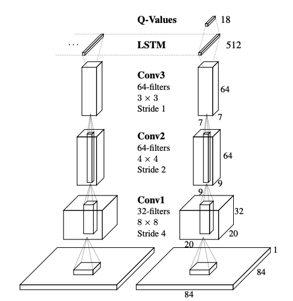
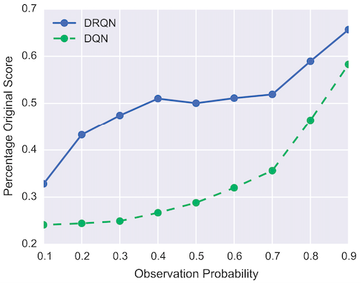

# Deep Recurrent Q-Learning for Partially Observable MDPs

**Authors**: Matthew Hausknecht and Peter Stone

**Year**: 2015

**Algorithm**: Deep Recurrent Q-Learning

**Links:** [[arxiv](https://arxiv.org/abs/1507.06527)]

### Highlights

- **Partially Observable Markov Decision Process (POMDP)**
- **LSTM + DQN**

### Prerequisite

- DQN algorithm [[paper](https://www.cs.toronto.edu/~vmnih/docs/dqn.pdf)] [[summary](https://github.com/RPC2/DRL_paper_summary/blob/master/01%20Model-Free%20RL/001%20Playing%20Atari%20with%20Deep%20Reinforcement%20Learning.md)]

### Problems to solve

- In the original formulation of DQN, the controllers have only limited memory (four frames) and assumes that the game state is fully observable. Using the above formulation, any game requiring memorizing more than four frames results in partial observability.

- Many real-world tasks are usually only partially observable, and the state information is often incomplete and noisy.

### Methods

- **Solving Partial Observability**
  - **POMDP** can be described by  — (states, actions, transitions, rewards). ,  is an observation.
  - In general cases, estimating a Q-value from an obervation can be arbitrarily bad since . The paper's goal is to narrow the gap between these two.

- **Network Architecture**
  - The DRQN architecture is constructed by combining Long Short Term Memory (LSTM) units with a Deep Q-Network. 
  - The input images are first convolved for three times, then will go through a fully-connected LSTM layer, followed by a final linear layer that outputs a Q-value for each action.
  - The LSTM layer is expected to integrate information through time (by learning and retaining information from many transition trajectories), and hence assist with the evaluations of the Q-values under partial observations.
  - The updated architecture:
    - 

- In the experiments, the trained DRQN is capable of making satisfactory decisions even if it is only given **a single frame** about the game state. It outperforms the original DQN algorithm especially when the given state information is incomplete. 
- **MDP to POMDP Generalization**: the experiments showed that the perfomance of a DRQN degrades more gracefully than DQNs, when it was trained on normal Pong (MDPs) and then evaluated on flickering Pong (screen is obscured with certain probability; POMDPs). The recurrent controllers have a certain degree of robustness against missing information, even trained with full state information.
  - 

### Comments

- The main contribution of this paper is the introduction of LSTM into the Deep Q Network. It significantly improves the results of certain games, but it's also worth noticing that the authors report no significant changes to many other Atari games. In the final section of the paper, the authors said "*While recurrency is a viable method for handling state observations, it confers no systematic benefit compared to stacking the observations in the input layer of a convolutional network*."  

